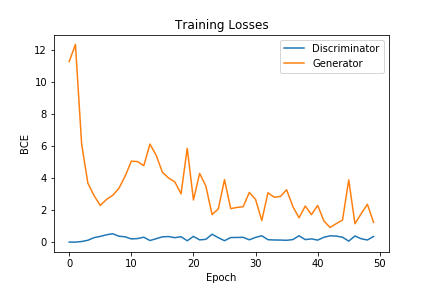

# MDGAN
In this repo you will find some experiments I have done with a GAN to generate three-dimensional conformations
for a given protein.

The GAN is trained using conformations obtained from MD simulations. The Generator aims to get
better at faking conformations that look like the conformations that are seen during the simulations.
The Discriminator tries to discern if a given conformation comes from a simulation (real) or from the
Generator (fake).


## Installation


```bash
conda install -c omnia msmbuilder mdtraj msmexplorer
pip install tensorflow-gpu  # or tensorflow if no GPU available
pip install keras
```

## Example

```python
from msmbuilder.example_datasets import AlanineDipeptide
from utils import make_trajectory_trainable
from mdgan import MDGAN

trjs = AlanineDipeptide().get().trajectories
data, sc = make_trajectory_trainable(trjs)  # sc is the MinMaxScaler we'll need it later
gan = MDGAN(n_atoms=22)
losses = gan.train(data, num_epochs=50)  # That's it
```


